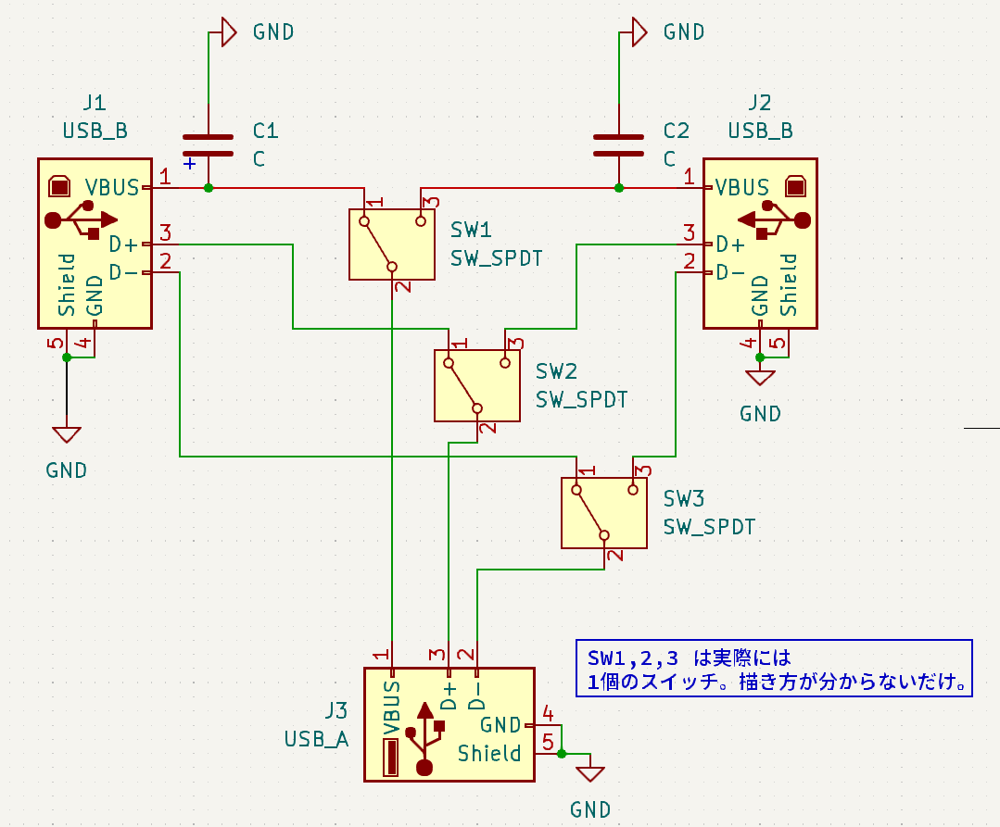
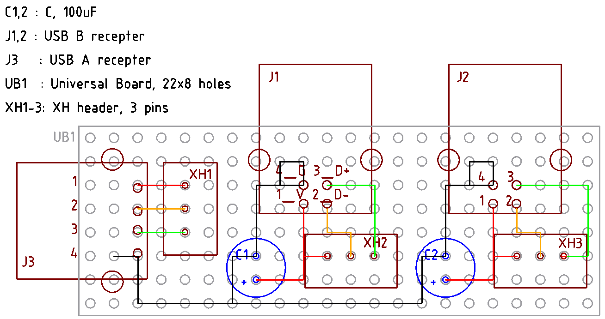

# USB 切り替え器を作ってみたい

## ver 1.0

まじめにやるなら TS3USB30EDGSR という専用のコントローラ IC を使うべきだけど、素人考えで、
信号線と電源線をつなぐだけで問題ないんじゃないかと、つまり、途中で線が変わってても、PC な
ど USB ホストコントローラ側には、そんなこと分からないんじゃないかという、舐めた考えて、た
だただ切り替えてみる。

実際に USB アナログスイッチ IC などで検索すると TS3USB30EDGSR などが出てくるが、中身を見る
とアナログスイッチのようである。秋月などで売っている一般のアナログスイッチを見ると思いのほ
かオン抵抗が大きい。100Ω単位である。こういうのが USB の邪魔になるということで存在している
IC なのではないだろうか。今回はむしろ、理想的には抵抗 0 の導線でつなぐだけなので、むしろ有
利な可能性すらあるのではないだろうか。

ミヤマの 3回路の物理なスイッチ MS-500M-B があるので、それを使ってみる。脳筋な感じが気に入った。

セルフパワーにしようかと思ったけど、出力側の USB コネクタはせいぜい 1, 2A な設計だろうから、
ここでセルフにする意味がない。セルフにするならハブ作るときにやるべきだ。

回路図はこちら

設計図はこちら。ユニバーサル基板は 23x8 穴必要。

スイッチ MS-500M-B 側はこちら。添字は設計図と回路図の J1-J3 の添字と同じ。左右は別に間違え
ても大丈夫。

| 左列 | 中央列 | 右列 |
| ---  | ---    | ---  |
| V1   | V3     | V2   |
| D-1  | D-3    | D-2  |
| D+1  | D+3    | D+2  |

