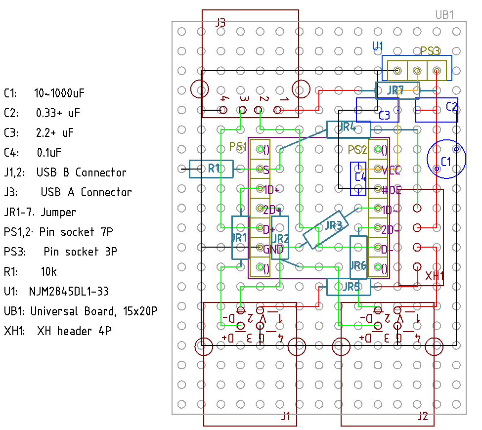
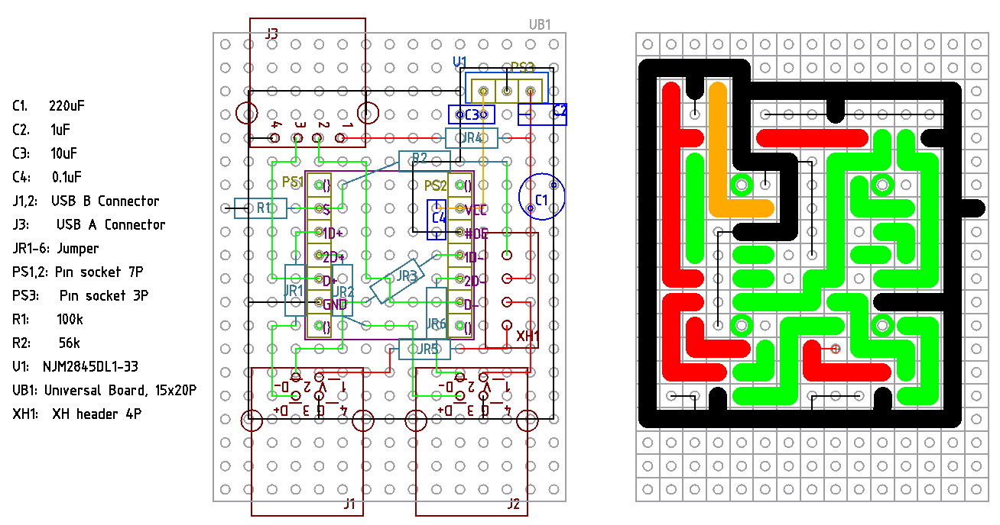

# TC7USB40FT を使う切替器

マルツで東芝の TC7USB40FT が買えそうなので、考えてみる。

[データシート](https://x.gd/IB3Yv)

IC は違うけど、ぱっと見ピンが同じだから、ここが参考になると思う。

https://geekyfab.com/entry/2021/08/26/223212

# v1.0

<!-- {{{ -->
## 部品の選定

### 3.3V レギュレータ

TC7USB40FT は最大でも 100mmA で、電圧降下が 1.7V なので  1.7V x 0.1A = 0.17W の発熱をする。

秋月で 3.3V リニアレギュレータで 1番人気が NJM2845DL1-33 で 800mA 流せる。ヒートシンクなし
で周囲温度 Ta=25℃、ジャンクション温度 (一番温度が上る場所) 150℃のときの消費電力 PD = 1W。

ジャンクションから空気までの熱抵抗 Ra は

Ra = dT / PD = 125/1 = 125 ℃/W

0.17W 発熱時の dT は Ra x 0.17W = 21℃。さらに秋月の変換基板 AE-TO-252-3-TR はガラエポの
2~3 倍の熱伝導率ということで、まあ余裕だろう。

選択していて気がついたが、安全に使えることを考えると「低損失」とかそういう枕詞よりも、熱抵
抗 Ra が小さいことが一番重要。

### スイッチ関連

スイッチの役目は 2個あり、電源の選択と TC7USB40FT の S ピンへの入力。

2回路のトグルスイッチでやるのが一番簡素。簡素なのだがスイッチを手元まで伸ばしたときに、電
源ラインを引っ張り回したくないという気持もある。

リレーと 1回路のトグルスイッチでやる方法も、わりと簡素。常時コイルに 5V 30-40mA 流れ続ける
か全く流れないので、半分半分なら 0.15~0.2W なんて誤差みたいなもの。これだと切り替え信号線
だけ引っ張り出せば良いので、すっきりする感じはする。

例えばオムロン G5V-1 はコイル電流 30mA でオン抵抗 100mΩ以下である。

参考回路は pMOSFET を反対向きにひっつけているが、それってフォトリレーじゃないのかと思いや
ってみたのがこちら。ただしフォトリレーが見当たらなかったので、フォトカプラでやっている。回
路は同じで行けると思う。入力電流が 7.5mA なのでリレーの半分だけどまあ誤差だろう。

東芝 TLP241A は定格の入力電流が 7.5mA、常時オン抵抗が 90mΩである。

迷ったら全部試してみたら良いだろうということで、初回は 2回路のトグルスイッチとする。

## 回路, 設計 1.0

[回路図](./TC7USB40FT/kicad/TC7USB40FT_1.0/TC7USB40FT_1.0.pdf)

スイッチの配線だけど、TC7USB40FT の S ピンをプルダウンしておくことで、かなり簡素化できた。
4芯ケーブルで事足りる。

親機側の USB B コネクタにはコンデンサは付けないことにした。なぜなら普段からケーブルを何も
考えずに引っこ抜いているので、それと何も変わならないと思ったからだ。

NJM2845DL1-33 へのコンデンサは、まずデータシートの応用回路例の通り CIN=0.33+uF, CO=2.2+uF
のセラコンとする。基本的に CIN も CO も容量が大きいのは問題ないようだ。

TC7USB40FT には一応パスコンを付けて、完了となる。

設計図も考えたが、とりあえず仮。レギュレータのコンデンサはレギュレータの基板に付けてしまう
のが良いのではないか、と考えているためなのと、ブレッドボードでのテスト結果次第なところがあ
るため。

仮部品表

| 記号   | 品番、品名など                            | 個数  |
| ---    | ------                                    | ---   |
| C1     | 100uF 前後で適当                          | 1     |
| C2     | セラコン 0.33uF 以上                      | 1     |
| C3     | セラコン 2.2uF 以上                       | 1     |
| C4     | セラコン 0.1uF                            | 1     |
| J1,2   | USB B コネクタ                            | 2     |
| J3     | USB A コネクタ                            | 1     |
| JR1-7  | ジャンパな何か                            | 7     |
| PS1,2  | ピンソケット 7P                           | 2     |
| PS3    | ピンソケット 3P                           | 1     |
| R1     | 10kΩ                                     | 1     |
| SW1A   | トグルスイッチ 2回路 on-on                | 1     |
| U1     | NJM2845DL1-33                             | 1     |
| U2     | TC7YSB4OFT                                | 1     |
| UB1    | ユニバーサル基板 15x20P                   | 1     |
| XH1    | XH ヘッダ 4P                              | 1     |
|        | その他                                    |       | 
|        | XH ハウジング 4P                          | 1     |
|        | スリムロボットケーブル 4芯                | 20~30cm |
|        | SSOP14P DIP 化基板 D014                   | 1     |
|        | ピンヘッダ 7P                             | 2     |
|        | ピンヘッダ 3P                             | 1     |
|        | XH コンタクト                             | 4     |

ブレッドボードでの試験では C1=220uF, C2=1uF, C3=10uF を使って成功に終わったので、これで設
計してみる。

と思って制作に入りかけたのだけど Sピンに 5V そのまま入れたのが気になって、今一度データシー
トを確認したら定格上限 (V_IN) が 4.3V となっているから、この回路はたまたまこの固体は動いた
かもだけど NG だった。最大が 4.6V だから、動かないどころか壊れても文句言えない状態だった。

プルダウンのままで行くのであれば, R1 と本来ジャンパの JR4 を変えれば良い。ちなみに Sピンの
漏れ電流は 1uA なので、電圧の誤差も考えてみる。

| R1[Ω]  | JR4[Ω] | V_IN[V] | 漏れ電流と R1 による電圧誤差 [V] |
| ---     | ---     | ---     | ---                              |
| 22k     | 10k     | 3.44    | 0.022                            |
| 56k     | 22k     | 3.59    | 0.056                            |
| 100k    | 56k     | 3.21    | 0.1                              |    

High 判定電圧 (V_IH) の最低値が 0.46xVCC なので、R1=100kΩの組み合わせで問題なさそう。また
Low 判定V_IL 最大値は 0.25 x VCC = 0.825V くらいあるので、こちらも R1=100kΩで問題なさそう。

3.3V でプルアップするのが素直な気もするが、基板を彫り始めてしまってるのでプルダウンのまま
やってみよう。
<!-- }}} -->

## 回路、設計 1.2
<!-- {{{ -->
というわけで考えた
[回路1.2](./TC7USB40FT/kicad/TC7USB40FT_1.2/TC7USB40FT_1.2.pdf)

無事、R1=100kΩ, R2=56kΩでブレッドボード試験に成功したので、設計図はこうなる。

いろいろあったけど無事に稼働。

気になるところとしては、レギュレータを差すのに背の低いピンソケットを使ったけど、これが不安
定。フラックスが昇って行くが、短いので端子全体に行き渡ってしまうから、接触不良になりやすい。
3.3V が完全に断線状態だった。接点復活剤でなんとかなったが、他にもなんかグラグラするので、
無理して在庫を使いきろうとせずに、背が高いものを使うほうが良さそう。

# v1.3、接地面積縮小化

設置面積を小さくしてみる。方法としては USB B コネクタ側を 180度折り畳む。

その他、以下の変更を含む。

- スイッチ IC DIP の 4隅はピンヘッダを付けない。
  - 当然、対応するソケットも付けない
  - これで、配線に少し余裕が出る
- LDO は直接はんだする。
  - 今の LDO に不満がないので、他の LDO を付ける予定が無い。
  - それをやるならペアとなるコンデンサも付け替え可能にするか、LDO 基板側にコンデンサを付け
    てしまう必要があるが、結局今の LDO に不満がないので、やる気も出ない。

ということで設計図はこちら。[設計図1.3](./TC7USB40FT/librecad/TC7USB40FT_1.3.pdf)

回路図は 1.2 から変更なし。[回路1.2](./TC7USB40FT/kicad/TC7USB40FT_1.2/TC7USB40FT_1.2.pdf)

部品表

| 記号   | 品番、品名など                            | 個数  |
| ---    | ------                                    | ---   |
| C1     | 220uF 電解コンデンサ                      | 1     |
| C2     | 1uF セラコン                              | 1     |
| C3     | 10uF セラコン                             | 1     |
| C4     | 0.1uF セラコン                            | 1     |
| J1,2   | USB B コネクタ                            | 2     |
| J3     | USB A コネクタ                            | 1     |
| JR1-8  | ジャンパな何か                            | 8     |
| PH1-3  | ピンヘッダ 2P, H=1.5mm                    | 3     |
| PH4,5  | ピンヘッダ 3P, H=1.5mm                    | 2     |
| PS1,2  | ピンソケット 5P                           | 2     |
| PS3-5  | ピンソケット 2P, H=3.5mm                  | 3     |
| PS6,7  | ピンソケット 3P, H=3.5mm                  | 2     |
| R1     | 100kΩ                                    | 1     |
| R2     | 56kΩ                                     | 1     |
| U1     | NJM2845DL1-33 DIP                         | 1     |
| U2     | TC7YSB4OFT DIP                            | 1     |
| UB1    | ユニバーサル基板 15x13P                   | 1     |
| UB2    | ユニバーサル基板 15x8P                    | 1     |
| XH1    | XH ヘッダ 4P                              | 1     |
|        | スイッチ部分                              |       |
| SW1A   | トグルスイッチ 2回路 on-on                | 1     |
|        | XH ハウジング 4P                          | 1     |
|        | 4芯ケーブル 20~30cm                       | 1     |
|        | XH コンタクト                             | 4     |
<!-- }}} -->

# v2.0, 電源、半固定

v1.0 シリーズの気になるところは、手元のトグルスイッチまで、電源ラインが往復することになる
のだけど、これが無駄な気がしてしまう。

それで Pch-MOSFET やフォトリレーを使って、電源をトグルスイッチ一つで切替える練習をしていた
のだが、これはこれで、今一、完全に乗り切れない。

https://x.gd/SR0y2
https://x.gd/oVwYn

というのも、そもそも別に誰が何処でも使えるものを作りたいのではなく、楽しく作れて自分で使え
れば良いのだ。そして切り替え器を使う PC の一つはデスクトップで、スタンバイ 5V 電源から常時
USB には供給されている。この電源を、同じコンセントから出ているもう一つのノートPC と、切り
変える必要ないよね。せいぜいジャンプソケット端子で選んでおいて、どうしても切替えなくちゃい
けないときだけ、切替えれば十分じゃないかな。

ということで電源は半固定として、トグルスイッチにはS セレクタピン用の GND 線だけにすれば、無
駄なノイズとかも出なそうな気がする。v1.3 では S ピンはプルダウンしておいて High の有無で切
替えたけど、今回はプルダウンしておいて Low で切替えれば良いだろう。

と言う分けで [回路図](./TC7USB40FT/kicad/TC7USB40FT_2.0/TC7USB40FT_2.0.pdf)

3.3V LDO は ABLIC の S-812C33AY-B-G。データシート読む限り、セイコー系のようだ。やっぱり個
人ではスルーホールタイプが使いやすいから。入力コンデンサについては全く指示がない。そもそも、
ここに至るまでに多くのコンデンサが付いていると思うので無くても良い気はするが、一応 1uF 程
度付けておく。出力コンデンサは参考データのところで 10uF のセラコンを使っているので、これに
習う。コンデンサについては、一応ブレボで LED 光らせるくらいの動作確認はしておこう。

S ピンのプルアップ抵抗は 100kΩにしておく。漏れ電流が最大 1uA なので、これによる変動は
0.1V で十二分だろう。

また USB の電源ラインには 10uF くらいまでのコンデンサしか挿してはいけないということになっ
てるみたいだから 220uF のケミコンは外しておく。

その他はおおむね、これまでと同じ。

設計は、なるべく浮いたホールを作らずに、余ったホールは GND にできるようにした。あと USB の
穴開けも考慮した GND 配線とした。

[設計図](./TC7USB40FT/librecad/TC7USB40FT_2.0.pdf)

部品表

|記号    | 品番、品目                             |個数|
|--------|----------------------------------------|----|
|B1      | ユニバーサル基板 15x20P                |1   |
|C1      | 1uF 程度、種別問わず                   |1   |
|C2      | 10uF以下のセラコン                     |1   |
|C3      | 0.1uF 程度のセラコン                   | 1  |
|H1      | ピンヘッダ 3P                          |1   |
|        | 回路切り替えジャンパ                   |1   |
|J1,2    | USB-B コネクタ XM7B-0442               | 2  |
|J3      | USB-A コネクタ XM7A-0442               |1   |
| R1     | 100kΩ                                 |1   |
|S1,2    | ピンソケット 7P                        |2   |
| U1     | 3.3V LDO, S-812C33AY-B-G               | 1  |
| U2     | TC7USB40FT DIP                         | 1  |
| X1     | XH ポスト 2P                           |1   |
|        | XH ハウジング 2P                       | 1  |
|        | XH 端子                                | 2  |
|        | 2芯 (以上の) ケーブル                  | 1  |
|        | トグルスイッチ 1回路                   | 1  |

C2 のセラコンは LDO で LED でも光らせて、その時の波形を見て決める。10uF もいらない気はして
る。
→ S-812C33AY-B-G にはコンデンサ要らなそう。安心感のために CIN=CL=1.5uF を付けることにする。
ほぼ USB コネクタで場所を占めているので、コンデンサを省いたところで小さくはできないから。

