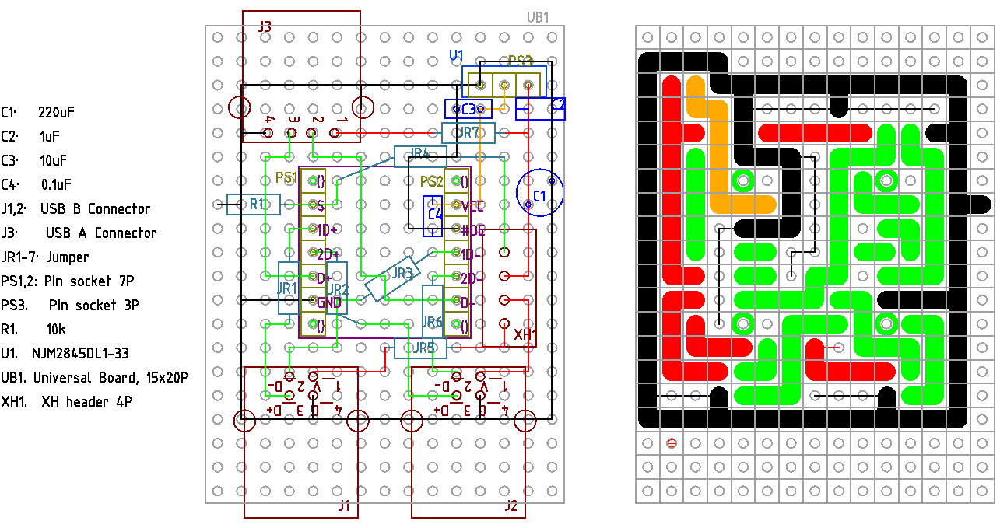

# TC7USB40FT を使う切替器

マルツで東芝の TC7USB40FT が買えそうなので、考えてみる。

[データシート](https://x.gd/IB3Yv)

IC は違うけど、ぱっと見ピンが同じだから、ここが参考になると思う。

https://geekyfab.com/entry/2021/08/26/223212

# v1.0

## 部品の選定

### 3.3V レギュレータ

TC7USB40FT は最大でも 100mmA で、電圧降下が 1.7V なので  1.7V x 0.1A = 0.17W の発熱をする。

秋月で 3.3V リニアレギュレータで 1番人気が NJM2845DL1-33 で 800mA 流せる。ヒートシンクなし
で周囲温度 Ta=25℃、ジャンクション温度 (一番温度が上る場所) 150℃のときの消費電力 PD = 1W。

ジャンクションから空気までの熱抵抗 Ra は

Ra = dT / PD = 125/1 = 125 ℃/W

0.17W 発熱時の dT は Ra x 0.17W = 21℃。さらに秋月の変換基板 AE-TO-252-3-TR はガラエポの
2~3 倍の熱伝導率ということで、まあ余裕だろう。

選択していて気がついたが、安全に使えることを考えると「低損失」とかそういう枕詞よりも、熱抵
抗 Ra が小さいことが一番重要。

### スイッチ関連

スイッチの役目は 2個あり、電源の選択と TC7USB40FT の S ピンへの入力。

2回路のトグルスイッチでやるのが一番簡素。簡素なのだがスイッチを手元まで伸ばしたときに、電
源ラインを引っ張り回したくないという気持もある。

リレーと 1回路のトグルスイッチでやる方法も、わりと簡素。常時コイルに 5V 30-40mA 流れ続ける
か全く流れないので、半分半分なら 0.15~0.2W なんて誤差みたいなもの。これだと切り替え信号線
だけ引っ張り出せば良いので、すっきりする感じはする。

例えばオムロン G5V-1 はコイル電流 30mA でオン抵抗 100mΩ以下である。

参考回路は pMOSFET を反対向きにひっつけているが、それってフォトリレーじゃないのかと思いや
ってみたのがこちら。ただしフォトリレーが見当たらなかったので、フォトカプラでやっている。回
路は同じで行けると思う。入力電流が 7.5mA なのでリレーの半分だけどまあ誤差だろう。

東芝 TLP241A は定格の入力電流が 7.5mA、常時オン抵抗が 90mΩである。

迷ったら全部試してみたら良いだろうということで、初回は 2回路のトグルスイッチとする。

## 回路, 設計 1.0

[回路図](./TC7USB40FT/kicad/TC7USB40FT_1.0/TC7USB40FT_1.0.pdf)

スイッチの配線だけど、TC7USB40FT の S ピンをプルダウンしておくことで、かなり簡素化できた。
4芯ケーブルで事足りる。

親機側の USB B コネクタにはコンデンサは付けないことにした。なぜなら普段からケーブルを何も
考えずに引っこ抜いているので、それと何も変わならないと思ったからだ。

NJM2845DL1-33 へのコンデンサは、まずデータシートの応用回路例の通り CIN=0.33+uF, CO=2.2+uF
のセラコンとする。基本的に CIN も CO も容量が大きいのは問題ないようだ。

TC7USB40FT には一応パスコンを付けて、完了となる。

設計図も考えたが、とりあえず仮。レギュレータのコンデンサはレギュレータの基板に付けてしまう
のが良いのではないか、と考えているためなのと、ブレッドボードでのテスト結果次第なところがあ
るため。

仮部品表

| 記号   | 品番、品名など                            | 個数  |
| ---    | ------                                    | ---   |
| C1     | 100uF 前後で適当                          | 1     |
| C2     | セラコン 0.33uF 以上                      | 1     |
| C3     | セラコン 2.2uF 以上                       | 1     |
| C4     | セラコン 0.1uF                            | 1     |
| J1,2   | USB B コネクタ                            | 2     |
| J3     | USB A コネクタ                            | 1     |
| JR1-7  | ジャンパな何か                            | 7     |
| PS1,2  | ピンソケット 7P                           | 2     |
| PS3    | ピンソケット 3P                           | 1     |
| R1     | 10kΩ                                     | 1     |
| SW1A   | トグルスイッチ 2回路 on-on                | 1     |
| U1     | NJM2845DL1-33                             | 1     |
| U2     | TC7YSB4OFT                                | 1     |
| UB1    | ユニバーサル基板 15x20P                   | 1     |
| XH1    | XH ヘッダ 4P                              | 1     |
|        | その他                                    |       | 
|        | XH ハウジング 4P                          | 1     |
|        | スリムロボットケーブル 4芯                | 20~30cm |
|        | SSOP14P DIP 化基板 D014                   | 1     |
|        | ピンヘッダ 7P                             | 2     |
|        | ピンヘッダ 3P                             | 1     |
|        | XH コンタクト                             | 4     |

ブレッドボードでの試験では C1=220uF, C2=1uF, C3=10uF を使って成功に終わったので、これで設
計してみる。

と思って制作に入りかけたのだけど Sピンに 5V そのまま入れたのが気になって、今一度データシー
トを確認したら定格上限 (V_IN) が 4.3V となっているから、この回路はたまたまこの固体は動いた
かもだけど NG だった。最大が 4.6V だから、動かないどころか壊れても文句言えない状態だった。

プルダウンのままで行くのであれば, R1 と本来ジャンパの JR4 を変えれば良い。ちなみに Sピンの
漏れ電流は 1uA なので、電圧の誤差も考えてみる。

| R1[Ω]  | JR4[Ω] | V_IN[V] | 漏れ電流と R1 による電圧誤差 [V] |
| ---     | ---     | ---     | ---                              |
| 22k     | 10k     | 3.44    | 0.022                            |
| 56k     | 22k     | 3.59    | 0.056                            |
| 100k    | 56k     | 3.21    | 0.1                              |    

High 判定電圧 (V_IH) の最低値が 0.46xVCC なので、R1=100kΩの組み合わせで問題なさそう。また
Low 判定V_IL 最大値は 0.25 x VCC = 0.825V くらいあるので、こちらも R1=100kΩで問題なさそう。

3.3V でプルアップするのが素直な気もするが、基板を彫り始めてしまってるのでプルダウンのまま
やってみよう。

## 回路、設計 1.2

というわけで考えた
[回路1.2](./TC7USB40FT/kicad/TC7USB40FT_1.2/TC7USB40FT_1.2.pdf)
