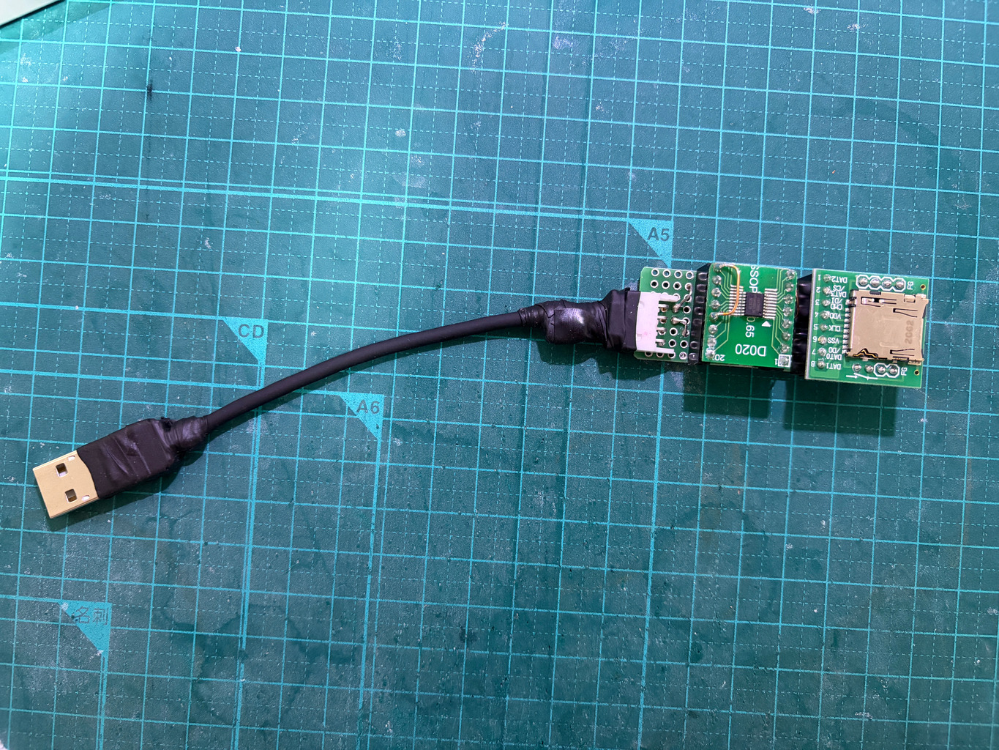

# v1.0 GL823K 使用 (回路間違い、動かない)

[GL823K datasheet](./v1.0/GL823K.pdf)

データシートには参考回路はついてないが、Github にプロジェクトがある。便宜上、こちらを参考
回路と呼ぶ。

https://github.com/SteveLRojas/GL823K_CARD_READER

の
[参考回路図](https://raw.githubusercontent.com/SteveLRojas/GL823K_CARD_READER/main/V1.1/pdf/gl823k_card_reader.pdf)

いくつかの安定用のコンデンサ以外は、USB - GL823K - SD カードをそのまま繋ぐだけで良いようだ。
なお、MMC よりも圧倒的に入手しやすい SD とする。

SD カードスロットは
[秋月 105488 マイクロSDカードスロットDIP化キット](https://akizukidenshi.com/catalog/g/g105488/)
で良さそう。

コネクタはヒロセのようだし、レベル変換機能とか余計なものがついていないため。

またはいろんなところで買える Sunhayato CK-40 でも良い。

https://shop.sunhayato.co.jp/collections/universal-boards/products/ck-40

とりあえず、SD スロットは目処がついた。

ただ、GL823K が 0.635mm ピッチで、ぴったりの基板は秋月にあるけどサンハヤトにはないので、秋
月 SD を前提に考える。

参考回路を見ると VDD と VDDA をまとめてるけど、これは両方とも LDO の出力だと思う。5V には
input と書いてあって、こっちには source と書いてあるから、input ではないはず。

でもちょっと怖いので、念のためジャンパーで繋げられるようにしておいて、テストしてみよう。

基板に TYPE-A つけて、USB メモリみたいに直接挿せるのが理想だが、幅、薄さ、強度ともに自信が
ないので、まずは TYPE-A ケーブルを伸ばしておく作りにしよう。基板から XH コネクタで、先端が
TYPE-A。

途中で GL823K の GPIO ピンをどうしたら良いのかデータシート見ても分からなくなったが、適当に
"GL823K DIY" で検索して出てきた回路は GND に落としているものが多いので、GND に直結で良さそ
う。

GEMINI によると SD スロットはたいていカードを指すと検出ピンが GND に落ちるらしいので、参考
回路も GND に落とすことになっていると思われる。使われてる TE のスロットのデータシートが出
てこなかったのであくまで予測ではあるが、他の回路と一致する。

[回路図](./v1.0/USB_SD_Reader_v1.0/USB_SD_Reader_v1.0_Schematics.pdf)

で 0.65mm の変換基板にはんだしてみたら、すんなりぴったりと載せてはんだできた。
そして設計してみたら、サンハヤトの CK-40 の方がユニバーサル基板の使用面積が小さいし、なに
より GL823K の 16P DIP 基板と幅が一致するので、なんとなく美しい気がする。もちろん気のせい
だ。

そこで設計はハヤトの CK-40 とすることにした。高いが送料無料でヨドバシで買えるというメリッ
トもある。回路図は、ピンの順番が違うだけだから、そのままでいいでしょう。

[設計図](./v1.0/USB_SD_Reader_v1.0_hayato.pdf)

図面の部品表

| 記号 | 品番、品目             | 個数 |
| ---  | ----------             | ---- |
| B1   | ユニバーサル基板 8x20P | 1    |
| C1,2 | セラコン 0.22uF (適当) | 2    |
| C3   | セラコン 1.5uF (適当)  | 1    |
| S1-3 | ピンソケット 8P        | 3    |
| S4,5 | ピンソケット 4P        | 2    |
| U1   | GL823K DIP 基板        | 1    |
| U2   | Sunhayato CK-40        | 1    |
| X1   | XH ヘッダ 4P サイド    | 1    |

DIP 基板作るためのピンヘッダ 

| 品番、品目    | 個数 |
| ----------    | ---- |
| ピンヘッダ 8P |  3   |
| ピンヘッダ 4P |  2   |

XH コネクタの先の USB ケーブルの部品表

| 品番、品目                             | 個数 |
| ----------                             | ---- |
| XH ポスト 4P                           |  1   |
| XH 端子                                |  4   |
| シールド付き 4C or 3C ケーブル 10cm 位 | 1    |
| USB type-A プラグコネクタ              | 1    |

3C ならシールドを GND として使えそうなもの。

結果は、失敗。VDD と VDDA をつなげないと動かない。両方が内蔵 LDO の出力なのではなく、どち
らかが出力、どちらかが入力となっているようだ。変換基板上でなんとかした。

まあそれは、知らなかった上にデータシートにも載ってないから仕方ないけど、今回はそれ以外に反省点が多い。

- せっかく作業性を考えて、全部表面配線としたのに、GND と電力線を、いつもの裏面配線の感じで、
  最後に回してしまった。背の高いソケットが邪魔で仕方なかった。表配線は、背の低い部品として、
  先にはんだしないと。
- 最初、USB メモリみたいなことを考えてたので、その延長で、インターフェースを type-A とした
  が、意味がない。頻繁に使うものではないし、普通に type-B 受け側で、普通の USB 機器として
  おいた方が、しまうのに線が邪魔にならなくて便利だったと思う。
- スリムロボットケーブルは AWG28. TYPE-A 側のはんだにはちょうど良いが、XH 側には細くて、コ
  ンタクトのカシメがやりにくい。何回かすっぽ抜けた。

しかし良かったことや、発見もあった。

- 表配線は、作業の順番が素直。配線を含めて背の低い順にはんだしていけばいい。
- 配線増強用のシール基板やショートバーの位置合わせは、爪楊枝が良い。穴に挿してバーを固定す
  ることで、最初ははんだに両手を使える。半田が溶けたら、爪楊枝をしっかり押し込みながら、こ
  ても押し込んで、バーを基板になるべくひっつける。最後は、爪楊枝をしっかりと抑えながら、こ
  てを抜けば、バーが回転してしまったりしない。
- 変換基板は、ピンの数が少なくても、切って使える(切らなくても無駄に大きいだけで使える)
