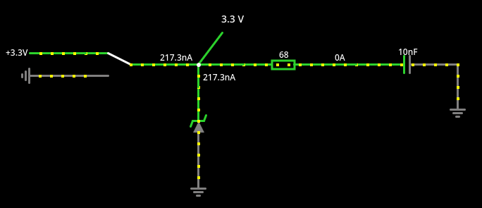
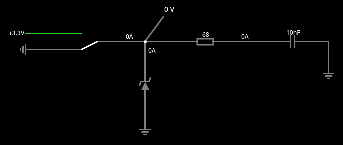

# USBasp の自作

本家

https://www.fischl.de/usbasp/

自作してる人はたくさんいて、その中で参考にしたのがこちら。マイコンのシンボルが実機と同じ配
置になってて、見易いから。

http://www.cs.shinshu-u.ac.jp/~haeiwa/m-com/USBasp/USBasp_new.html

それから、この方。非常に簡略化されていて、必要な部分が分かりやすい。

https://deltav-lab.techblog.jp/archives/30113269.html

最初に思った感想が、なんで USB 機能のあるマイコンを使わないんだろうってところ。

## ver 1.0

まず分からないのが D-, D+ に配置されている定電圧ダイオード。

https://www.falstad.com/circuit/circuitjs.html

で計算しても、電圧は 3.3V か 0V で信号レベル変換にはなっていない。
[回路ファイル](./misc/USB-D_Diode_why.txt)

寄生インダクタンスによる電圧のオーバーシュートが恐いとしても、信号ラインにダイオード入れて
るのは初めての経験。なんとなくだけど 5V マイコンのために昇圧しようと考えて入れたけど、実は
働いていないということなのではないだろうか。

その先の抵抗も分からない。

そもそも Arduino Uno R3 の Tx, Rx に何故抵抗が入っているのかも良く分からない。他から Tx,
Rx 使われたときの保護とある。まあ一応他が High で自分が Low のとき、理想的な回路なら無限の
電流が流れるから、それに対する保護かな。ただマイコンのピンは対して電流流せないから、そんな
ことしても、High 側の電圧が下がるだけだとは思うけど。

https://forum.arduino.cc/t/resistors-on-the-rx-and-tx-lines-of-the-arduino-pro/154783/4

少なくとも、本機で、2個以上の信号線が混ざることはないから、保護目的なる抵抗は不要だ。

RESET をヘッダに出しているのは、本機をプログラムするときのためのもののようだ。本機はブレボ
で書き込むから、これも不要だ。

そんなこんなで
[回路図1.0](./kicad/USBasp_1.0/USBasp_1.0.pdf)

まずはブレッドボードで組んで ASOBoard に Lチカでも書き込んでみるところから始めよう。設計は
後回し。LED は要らん。必要になっても手持ちの LED と抵抗でなんとかなる。ジャンパもブレボ上
ならなんとでもなるので不要。

試験向け部品表

| 回路図記号 | 品目等 | 個数 |
| ---        | ---    | ---  |
| C1         | ケミコン 1uF | 1 |
| C2         | セラコン 0.1uF   | 1 |
| C3,4       | セラコン 15pF    | 2 |
| J1         | USB B Dip 化基板 | 1 |
| R1         | 10kΩ            | 1 |
| R4         | 2kΩ             | 1 |
| U1         | ATmega8-16PU     | 1 |
| Y1         | 水晶 12MHz       | 1 |

USB デバイスとして認識するところまではできたが、どうやっても接続相手を認識しない。実力不足
でギブアップ。

[設計図](./librecad/USBasp1.0.pdf)。一応何か勘違いして回路を間違えていた可能性があるので、
作ってみる。ASBoard 用 Arduino as ISP シールドがそのまま挿せるようにしてある。これで駄目な
ら、大人しく、Arduino as ISP 一本でなんとかしていくことにする。

実装用部品表

| 設計図記号 | 品目等                  | 個数 |
| ---        | ---                     | ---  |
| C1         | ケミコン 1uF            | 1    |
| C2         | セラコン 0.1uF          | 1    |
| C3,4       | セラコン 15pF           | 2    |
| D1,2       | LED                     | 2    |
| IS1        | IC ソケット 28P         | 1    |
| J1         | Omron USB-B コネクタ    | 1    |
| JR1-3      | ジャンパ線              | 3    |
| PH1        | ピンヘッダ 2P           | 1    |
| PS1,2      | ピンソケット 14P        | 2    |
| R1         | 10kΩ                   | 1    |
| R2,3       | 1kΩ                    | 2    |
| R4         | 2kΩ                    | 1    |
| U1         | ATmega8P                | 1    |
| UB1        | ユニバーサル基板 21x14P | 1    |
