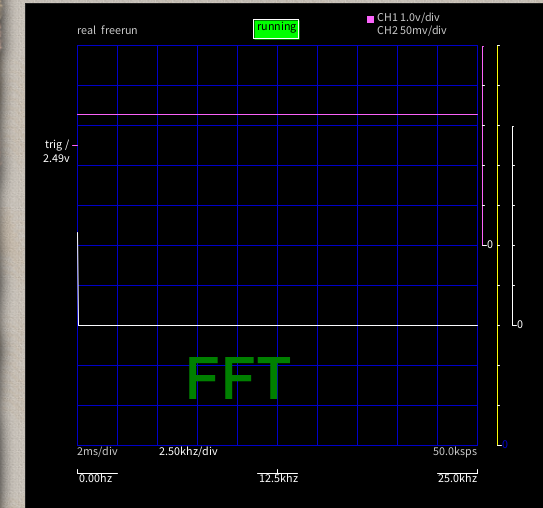
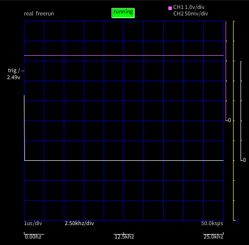
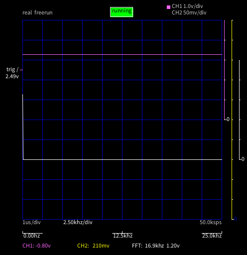

# S-812C33AY-B-G 3.3V LDO

エイブリックという会社の LDO。セイコー系？

VOUT に R=300Ωと LED を繋いで九工大オシロで波形の確認。電源は PC の USB。九工大オシロで認
識できないようなノイズはどうせ自分には対策できない。

データシートには CIN の指示はなく CL は無くても動くとある。試験は CL=10uF で行なわれている。

CIN, CL ともに無しの場合でも、全くノイズを認識できない。

CIN=CL=1.5uF でも、もちろんノイズは認識できない

CIN=1.5uF, CL=10uF でも、もちろんノイズは認識できない。

これにとっての CIN は、電力を供給している側の CL なので、無いわけはない。十分なのだろう。

最小化を目指すなら CIN,CL 無し、なんとなく安心が欲しければ 1uF くらいを付けておけば良さそ
うだ。
