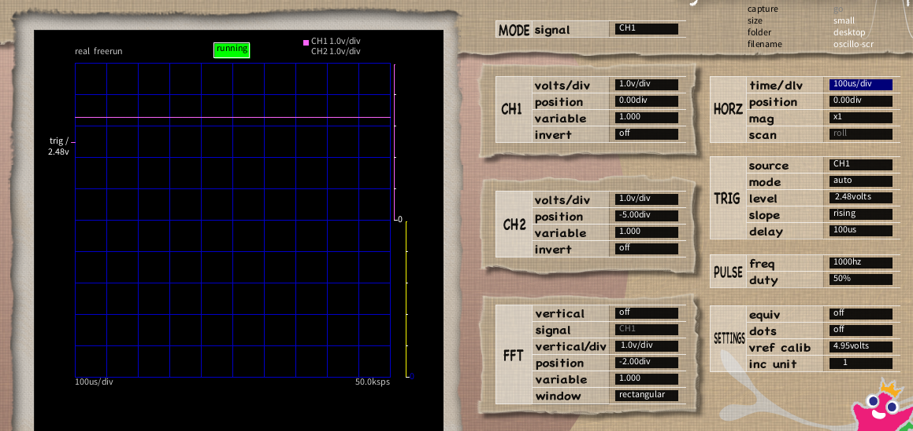

# レギュレータをテストしたときの記録

## NJM2845DL1-33

降圧のリニアレギュレータ。データシートはここ。
https://x.gd/h29fk

変換基板は秋月 https://akizukidenshi.com/catalog/g/g109075/

サンハヤトとダイセン電子工業には、このタイプは無いようだ。

C_IN, C_OUT ともに推奨値以上なら良いということなので C_IN に 1uF のセラコンl (推奨値
0.1uF)、C_OUT に 10uF のセラコン (推奨値 2.2uF, セラコン指定) を付けて、青色 LED を直結し
て kit_scope オシロで観察したのがこちら。

なんちゃってオシロではノイズが観測できないくらい安定している。
