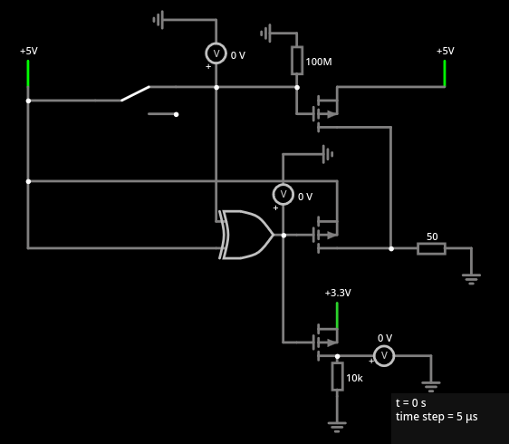
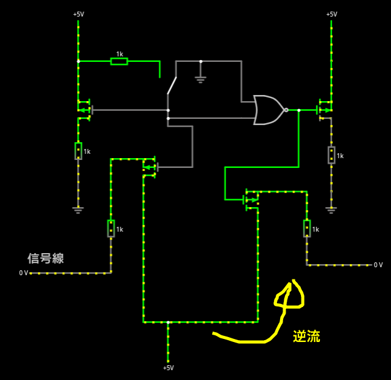
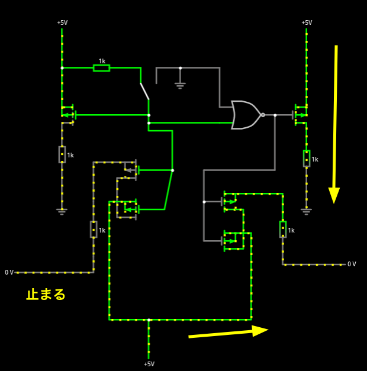

# Pch Mosfet の学習

# 電力ラインの切替え方の練習

## 前書き

USB Hub のバスパワー、セルフパワーの切り替えの練習をしてみた。Nch と Pch だけど、自分の理
解では Pch が、こちらから電力、電流を送り出して使うタイプ、電圧で言うと高い方に位置し、Nch
がこちらに電力、電流を引き込んで使うタイプ、電圧だと低い方で使うものなので、機能の切り替え
スイッチみたいなのは、Pch が便利、というか自分では Nch を切り替えに使えなかった。

USB Hub ではセルフとバスの電力ラインの切替えと USB IC の PSELF ピンへセルフのときは 3.3V
で high, バスのときは Low を入れる必要がある。

## 完成した回路

自分なりになんとかできあがった回路がこちら。

ネットリストはこちら

[ネットリスト](./PchMosFETSelfTraining.txt)

こちらですごく分かりやすくリアルタイムシミュレーションできる。

https://www.falstad.com/circuit/

XOR 回路は、そうい IC もあるし、余っている PIC でも良いし、ググればトランジスタで作る方法
も出てくる。

## やってみた感想

十分な電流に対応してる物理スイッチがあるなら、そっちが楽だと思った。なんかの動画で MOSFET
はオン抵抗が断然に物理スイッチより低いというのを観たと思うけど、実際、NKK のロッカスイッチ
M-2022NB は 10mΩで、これより小さい Pch MOSFET は東芝 TJ60S04M3L の4.8mΩくらいで、見つけ
ることはできなかった。

個人の電子工作なら物理スイッチで十分かなあ。むしろ時代に逆行してて、ロマンさえある感じがす
るし。

先程のスイッチの秋月の売り場

https://akizukidenshi.com/catalog/g/g113216/

https://akizukidenshi.com/catalog/g/g116297/

# 信号線に使う方法の練習

ドレイン側に GND がある場合の使いかた、つまりソースからドレインに流れると分かりきっている
場合の使い方は分かったが、信号線、つまり、どちらが high でどちらが low か分からないものに
も使えるのか疑問が出てきたのでやってみた。

ネットリストはこちらで

[ネットリスト](./pMOSFET信号線練習.circuitjs.txt)

すると、MOSFET はスイッチを閉じていてもドレインからソースに逆流できてしまうことが分かった。

そこで MOSFET を 2個逆向きに直列してみたら、逆流しなくなることが分かった。

そしてこの MOSFET を逆向きに 2個つなぐというのはフォトリレーがやっていることのようだ。

https://akizukidenshi.com/goodsaffix/TLP222Aj.pdf

つまり、信号線にはフォトリレーを使えば良いということが分かった。
