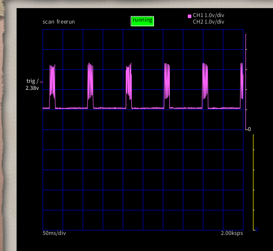
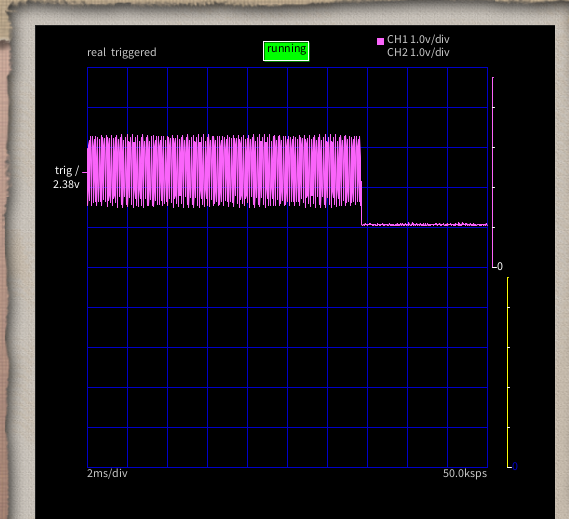

# LMT01LPG 使ってみる

データシート:

https://x.gd/vT8MS

仕組み:

温度に応じて出力 VN ピンにパルスを出す。入力 VP は 2-5.5V が定格。

パルスは 6.9, Figure 1 の通りで、VP を High にしてしばらくすると VP に 34uA と 125uA のパ
ルスを出す。パルス出力は電源を供給している限りし続けるので、適当なタイミングでカウントを完
了しなくてはならない。

ATMega328P は 0.6 VCC 以上の電圧で High 入力と見なすので VCC=5V とすると 3V は必要となる。
このため 3V/125uA = 24kΩ以上の抵抗が必要。また 5V は超えたくないので 5V/125uA = 40kΩは超
えてはならない。

逆に 0.3 VCC 以下で Low と見なすので 34uA で1.5V 以下にする必要がある。1.5V/34uA = 44kΩ以
下の抵抗にする必要がある。

と言うことで 30kΩくらいの抵抗で良いだろう。High が 3.75V, Low が 1.02 V と良い感じであろ
う。

パルスの吐き出しは、電源投入してから TCONV 時間で測定し TDATA 時間でパルスを出す。TCONV の
最大が 54ms で TDATA の最大が 50ms なので、最長で 104ms。一方、TCONV の最短は 46ms で
TDATA の最短は 44ms なので、2回目の TDATA 突入までの時間は 46+44+46 = 134ms となる。つまり
最大の 104ms に合わせてカウントして何も問題ないと言うことである。

カウントは水晶チェッカーの時に使った attachInterrupt を使えば良いだろう。

オシロで波形を取ってみたが、これ ATMega328P で捉えられるのだろうか。

